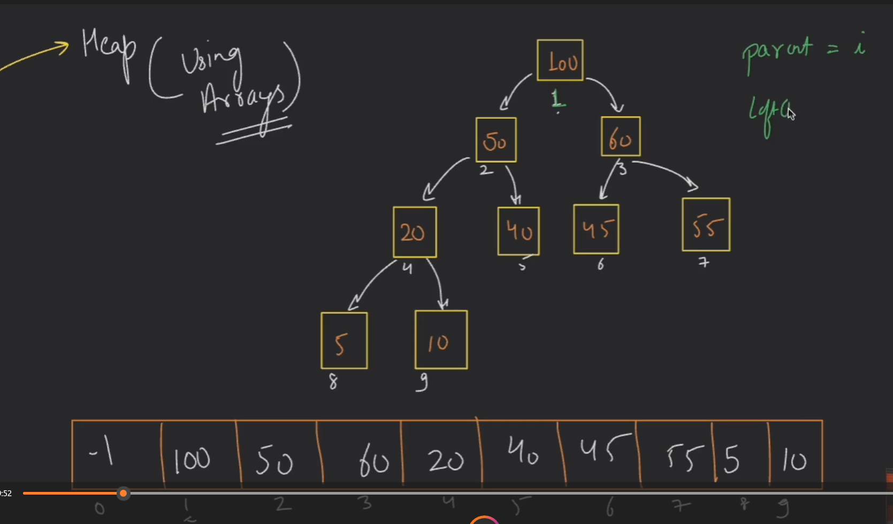

## Heap :

#### Heap is a data structure which follows two constraints :

- it's a `complete binary Tree  `
- Value of child nodes is either smaller or larget than parent element

1 . `Max Heap` : Child nodes have smaller values than parent node
2 . `Min Heap` : Child nodes have larger values than parent node

#### Complete Binary Tree :

- `Complete binary tree : ` :
  - All levels of this binary trees are filled , except for last one
  - Elements are filled in left to right manner

### Notes about Heap :



- If we store node's element in array accordingly to index.
- We'll observe that

  - if `parent child` have index : `i` then:

    - `Left child ` = `2i` ( for 1 -based indexing) = `2i+1` for (0-based indexing)

    - `Right child ` = `2i+1` (for 1-based indexing) = `2i+2` for (0-based indexing)

  - For any `index = i` , Parent will be : `i/2`

  ***

### `Insertion` in Heap : [ T.C = O(n) ]

- To insert an element in heap :

```cpp
 void insert(int num)
    {
        size++; // as an element is being inserted , size++;
        int index = size;
        arr[index] = num;
        while (index > 1) // now it's 1 based indexing and root have no parent so we'll stop at index >1
        {
            int parent = index / 2; // from the formula we will get the index of parent node
            if (arr[index] < arr[parent]) //  if(child have smaller value than parent we are all good so break)
                break;

            else // if child have larger value , swap them and now repeat until we break the condition
            {
                swap(arr[index], arr[parent]);
                index = parent;
            }
        }
    }
```

1. Place the Element at vacant position :
2. Now place it in correct positon
   - swap Parent and child if parent have smaller value , repeat until it's placed correctly

---

## `Deletion` in HEAP `O (log N)`

```cpp
 void deletion()
   {
       // exception case :
       if (size == 1)
       {
           size--;
           return;
       }

       if (size <= 0)
       {
           cout << "heap underflow" << endl;
           return;
       }

       // Note - Only root node can be deleted so deletion :)
       /*
            can be perfomed in two easy peasy steps:
            1- replace root node with last node  and delete last node
            2- place root to it's correct position
       */

       // Replacing root with last element :
       int temp = arr[1];
       arr[1] = arr[size--]; // arr[1] = root , and arr[size]

       // find correct position for root node :
       int index = 1;
       while (index < size)
       {
           int left_index = 2 * index; // find left and right index
           int right_index = 2 * index + 1;
           int largest_index = index;
           // out of left and right child , choose the biggest one and replace it with root
           if (left_index <= size && arr[largest_index] < arr[right_index])
           {
               largest_index = right_index;
           }

           if (right_index <= size && arr[largest_index] < arr[left_index])
           {
               largest_index = left_index;
           }

           if (largest_index == index)
               return;
           else
           {
               swap(arr[index], arr[largest_index]);
               index = largest_index;
           }
       }
       cout << "Successfully Deleted : " << temp << endl; // easy laif
   }
};
```
